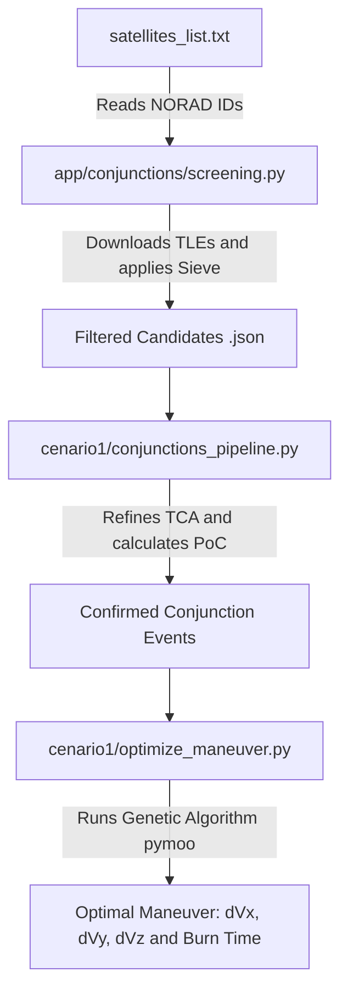
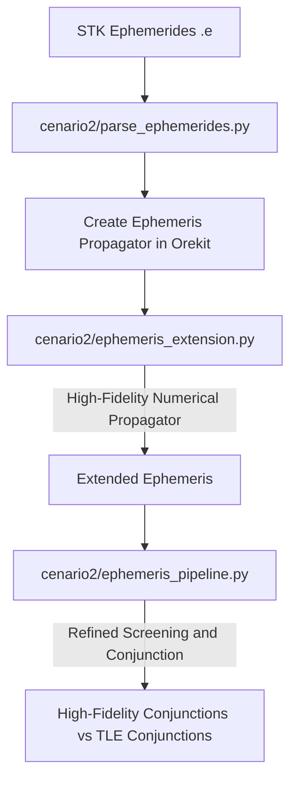

# 🛰️ Conjunction Analysis and Evasion Maneuver Optimization System (Master's Thesis)

[](https://www.python.org)
[-orange.svg?style=flat-square)](https://www.orekit.org/)
[-red.svg?style=flat-square)](https://pymoo.org/)
[](https://github.com/astral-sh/uv)

This repository contains the software suite and algorithms developed for **Guima's Master's Thesis** in Space/Aeronautical Engineering. The system focuses on **Satellite Orbital Conjunction Analysis**, large-scale space object filtering (Screening), and **Collision Avoidance Maneuver (CAM)** optimization using evolutionary algorithms.

The mathematical and orbit propagation infrastructure is based on **Orekit** (via the `orekit-jpype` Python interface), ensuring high fidelity and compliance with industrial celestial mechanics standards.

---

## 📌 Table of Contents
- [🚀 System Features](#-system-features)
- [🏗️ Architecture and Directory Structure](#️-architecture-and-directory-structure)
- [🔄 Workflow & Scenarios](#-workflow--scenarios)
  - [Scenario 1: Analytical Propagation (TLE) and Optimization with Genetic Algorithm](#scenario-1-analytical-propagation-tle-and-optimization-with-genetic-algorithm)
  - [Scenario 2: High-Precision Ephemeris Analysis and Extension (STK)](#scenario-2-high-precision-ephemeris-analysis-and-extension-stk)
- [📦 Requirements and Setup](#-requirements-and-setup)
- [🛠️ Usage Instructions](#️-usage-instructions)
  - [Running a Complete Campaign](#running-a-complete-campaign)
  - [Manual Execution of Individual Steps](#manual-execution-of-individual-steps)
- [📊 Plotting and Visualization](#-plotting-and-visualization)
- [🔬 Theoretical Background and Algorithms](#-theoretical-background-and-algorithms)
- [📄 Reference Documents](#-reference-documents)

---

## 🚀 System Features

* **Automated Orekit Configuration**: Dynamic download, extraction, and loading of Orekit physical data (`orekit-data-main.zip` containing gravity coefficients, IERS data, geomagnetic models, etc.).
* **Multi-Stage Sieve Filter (Sieve Algorithm)**: Coarse and fine filtering algorithm for batch safety ellipsoid crossing detection, processing thousands of secondary objects against base satellites in an extremely optimized way.
* **Precise TCA (Time of Closest Approach) Calculation**: Using the **Bisection** numerical method to find the exact instant of closest approach.
* **Collision Probability (PoC)**: Native support for Orekit's 2D analytical methods for short-term collision probability calculation:
  * *Alfriend (1999)*
  * *Alfriend Max (1999)*
  * *Alfano (2005)*
  * *Patera (2005)*
  * *Laas (2015)*
* **Maneuver Optimization (CAM)**: Single-objective or multi-objective Genetic Algorithm implemented via `pymoo` to design the optimal evasion maneuver (three-dimensional $\Delta V$ and burn time) by minimizing propellant consumption and maximizing miss distance or minimizing PoC.
* **External Ephemeris Processing**: Robust reader for `.e` ephemeris files from **STK (Satellite Tool Kit)** for high-precision numerical propagation and state extension.

---

## 🏗️ Architecture and Directory Structure

The project is divided modularly, separating the core application logic (`app/`) from execution scripts and specific pipelines for each test scenario:

```directory
.
├── pyproject.toml              # Dependency declaration and Python project configuration (PEP 621)
├── uv.lock                     # Deterministic lockfile of the 'uv' package manager
├── run_campaign.sh             # Bash script for automated screening campaigns and pipeline execution
├── satellites_list.txt         # Configuration file containing the NORAD IDs of the satellites to be analyzed
├── app/                        # Core modules and shared utilities
│   ├── __init__.py
│   ├── download_all_tles.py    # Download and caching of updated TLEs from CelesTrak/Space-Track
│   ├── models.py               # Object-oriented representation of satellites and orbital states
│   ├── orekit_config.py        # JVM/JPype initialization and automated bootstrapping of 'orekit-data'
│   ├── utils.py                # Mathematical functions, formatting, and orbital frame handling
│   └── conjunctions/           # Specific algorithms for conjunction screening and analysis
│       ├── bisection.py        # Refined numerical search for TCA
│       ├── config.py           # Safety ellipsoid parameters, PoC threshold, and coefficients
│       ├── conjunction_analysis.py # Coordinate conversions (TEME to RTN/UVW), covariance matrices, and PoC
│       ├── ephemeris_screening.py  # Tailored screening for high-precision ephemeris data
│       ├── filter_pre.py       # Preliminary filters based on Apogee/Perigee
│       ├── main.py             # Interactive command-line script for ad-hoc conjunction analysis
│       ├── screening.py        # Coordinates the screening (Sieve) execution
│       └── sieve.py            # Vectorized implementation of the Sieve approximation algorithm
├── cenario1/                   # Execution of Scenario 1 (TLEs + Genetic Algorithm)
│   ├── conjunctions_pipeline.py# Sequential screening and conjunction calculation pipeline
│   ├── optimize_maneuver.py    # Burn optimization script (CAM) using three-dimensional search with pymoo
│   ├── compare_maneuver.py     # Comparative analysis between different maneuver windows and orientations
│   └── analysis_results/       # JSONs with the optimization and convergence run results
├── cenario2/                   # Execution of Scenario 2 (STK Precision Ephemerides)
│   ├── parse_ephemerides.py    # Reader and translator of ephemeris files (.e) to Orekit
│   ├── ephemeris_extension.py  # Module to extend ephemerides using numerical propagators
│   ├── ephemeris_pipeline.py   # Conjunction analysis pipeline using real ephemerides
│   ├── compare_tle_ephemeris.py# Tool to compare analytical SGP4 propagation against precise ephemeris
│   └── data/                   # (Not versioned) STK ephemeris .e files (e.g., SP_XXXXX_extended.e)
├── docs/                       # Official academic files
│   ├── Master_thesis.pdf       # Full text of the Master's Thesis
│   └── Master_presentation.pdf # Presentation slides used in the public defense
└── [plotting scripts]          # Collection of chart generators (plot_orbits_3d.py, plot_miss_distance.py, etc.)
```

---

## 🔄 Workflow & Scenarios

The repository is optimized to run end-to-end two complementary methodologies of space traffic safety engineering:

### Scenario 1: Analytical Propagation (TLE) and Optimization with Genetic Algorithm
This scenario assumes the absence of precise operator ephemerides, relying on public TLE data:


### Scenario 2: High-Precision Ephemeris Analysis and Extension (STK)
In this scenario, high-precision operator ephemerides (`.e` files) are imported and integrated. If the ephemeris time span is short, the system extends the orbit consistently using high-fidelity numerical propagation configured in Orekit:


---

## 📦 Requirements and Setup

The project has been modernized to use **`uv`**, the high-performance Python package and environment manager written in Rust.

### 1. Prerequisites
* **Python 3.13 or higher**
* **Java Development Kit (JDK)**: Required for running Orekit-JPype (JDK 11 or higher is recommended).
* **uv**: If you don't have it installed, install it via:
  ```bash
  curl -sSf https://get.get.sh/uv | sh
  ```

### 2. Environment Initialization
You do not need to create a virtual environment manually. `uv` will manage everything transparently on the first command:
```bash
# Sync and install dependencies specified in pyproject.toml
uv sync
```

Upon the first startup of any script that utilizes Orekit, the `app/orekit_config.py` script will detect the absence of the `orekit-data` folder and automatically download it directly from Orekit's official GitLab repository.

---

## 🛠️ Usage Instructions

### Running a Complete Campaign
The simplest way to reproduce the tests is by executing the `run_campaign.sh` script. It reads the satellites of interest from the `satellites_list.txt` file and runs the sequential flow of **Scenario 1** (Initial Screening followed by the Conjunctions Pipeline):

```bash
# Ensure execution permission
chmod +x run_campaign.sh

# Run the simulation campaign for the default period (7 days)
./run_campaign.sh
```

### Manual Execution of Individual Steps

#### 1. Initial Screening (Coarse Sieve):
Filters thousands of objects in Earth orbit, selecting only those that cross the expanded safety ellipsoid (multiplied by 50x by default) of the base satellite of interest during a time window (e.g., 5 days):
```bash
uv run app/conjunctions/screening.py --base 47699 --days 5.0
```
The conjunction candidates are saved in `screenings/screening_47699_xxxxxx.json`.

#### 2. Fine Conjunction Pipeline:
Runs the bisection method and calculates the minimum miss distance and detailed probability of collision (PoC) for the candidates detected in the previous screening stage:
```bash
uv run cenario1/conjunctions_pipeline.py --base 47699 --days 7.0
```

#### 3. Evasion Maneuver Optimization (CAM):
Finds the optimal evasion maneuver using Genetic Algorithms (GA), aiming to redirect the satellite to mitigate the probability of collision with the lowest energy expenditure ($\Delta V$):
```bash
uv run cenario1/optimize_maneuver.py
```

---

## 📊 Plotting and Visualization

The suite features several robust utility scripts based on `matplotlib` for 3D and 2D visualization of conjunction scenarios:

* **3D Orbits at TCA**: Displays satellite trajectories in the Earth-centered inertial frame (TEME), highlighting the exact point of closest approach.
  ```bash
  uv run plot_orbits_3d.py
  ```
* **Three-Dimensional TCA Visualization with Ellipsoid**: Plots the relative trajectory of the secondary (intruder) satellite passing around the 3D safety ellipsoid (UVW) positioned on the primary satellite.
  ```bash
  uv run plot_3d_tca.py
  ```
* **Distance Evolution Over Time**: Displays the relative distance profile over time around the closest approach.
  ```bash
  uv run plot_miss_distance.py
  ```

---

## 🔬 Theoretical Background and Algorithms

> [!NOTE]
> **Default Safety Settings (app/conjunctions/config.py):**
> * **Safety Ellipsoid Semi-axes**: Radial ($R_U$) = 2000m, In-Track ($R_V$) = 5000m, Cross-Track ($R_W$) = 2000m.
> * **Characteristic Collision Radius ($R_c$)**: Conservatively set to 20 meters for the collision probability calculation.
> * **Critical Alert Threshold**: Collision Probability above $10^{-5}$ ($10^{-5}$ is the operational threshold widely adopted by agencies like NASA and ESA).

### The Filtering Sieve
The screening algorithm (*Sieve*) is executed in layers:
1. **Apogee/Perigee Filter**: Instantly eliminates secondary objects whose orbits never radially intersect (with a safety margin).
2. **Scalar Distance Filtering**: Propagates orbits using SGP4 at wide time intervals.
3. **Three-Dimensional Refinement**: Targeted propagation with a fine step and calculation of proximity of rotated ellipsoids in local coordinates (RTN/UVW).

---

## 📄 Reference Documents

The detailed conceptual foundation of the system can be found in the `docs/` folder:
* 📕 **[Master_thesis.pdf](file:///home/guima/code/dissertacao/docs/Master_thesis.pdf)**: Full scientific text, containing dynamic modeling, mathematical derivation of the 3D collision ellipsoid, mathematical formulation of the maneuver optimization problem, and analysis of results.
* 🖥️ **[Master_presentation.pdf](file:///home/guima/code/dissertacao/docs/Master_presentation.pdf)**: Slide presentation used in the public defense of the Master's degree.
